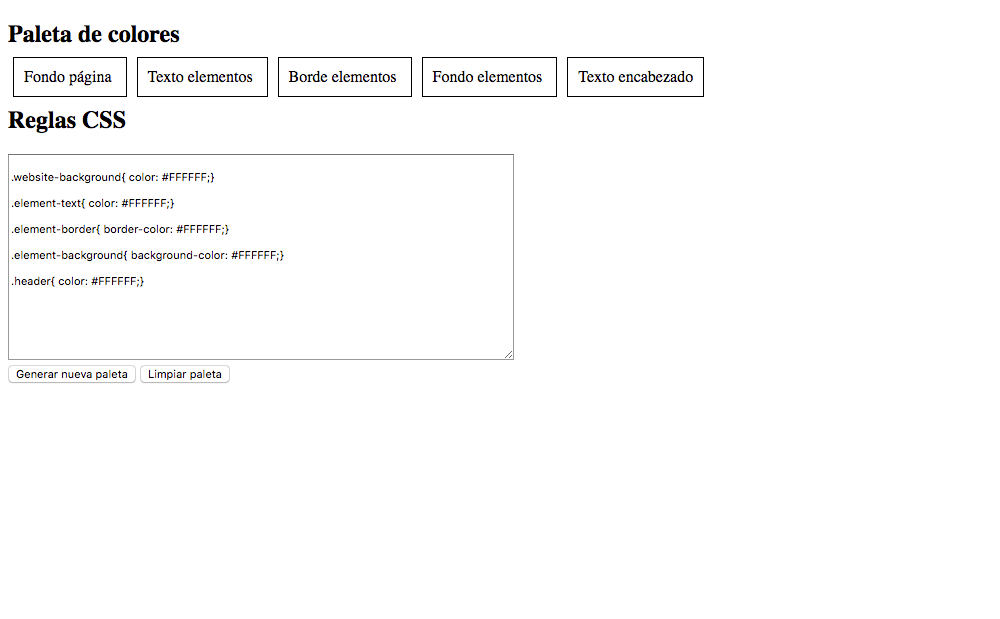
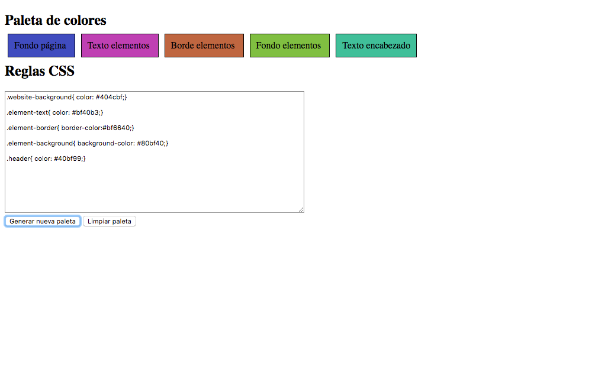
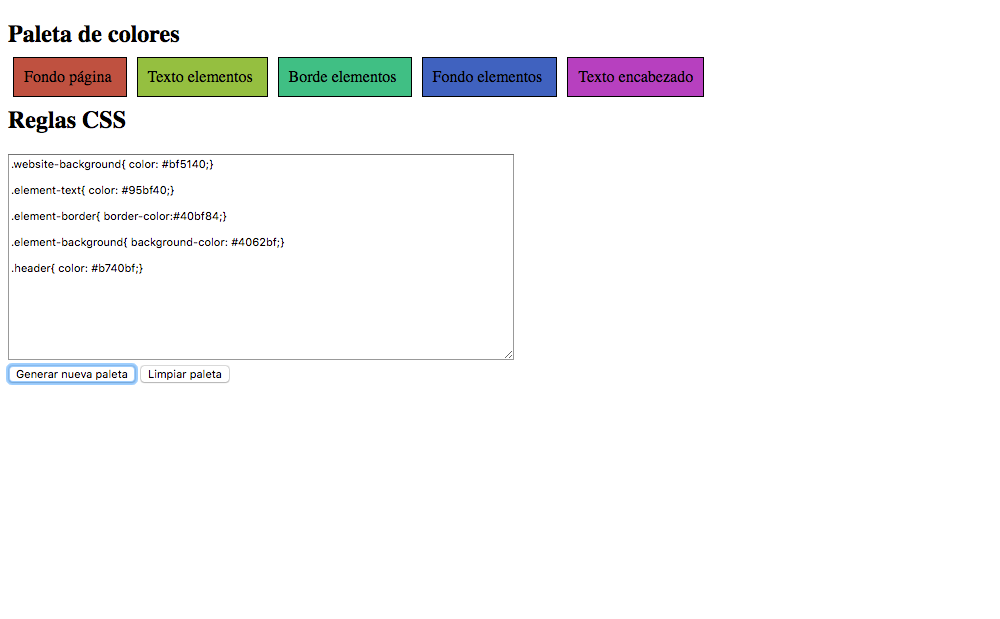
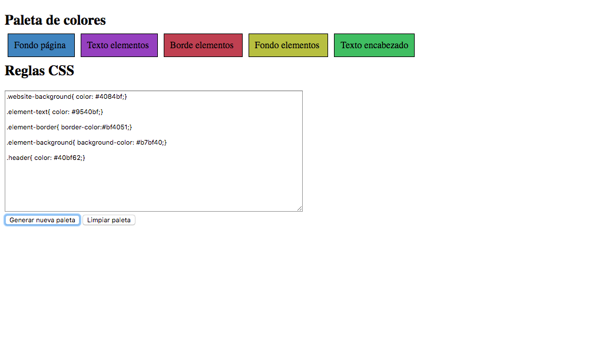
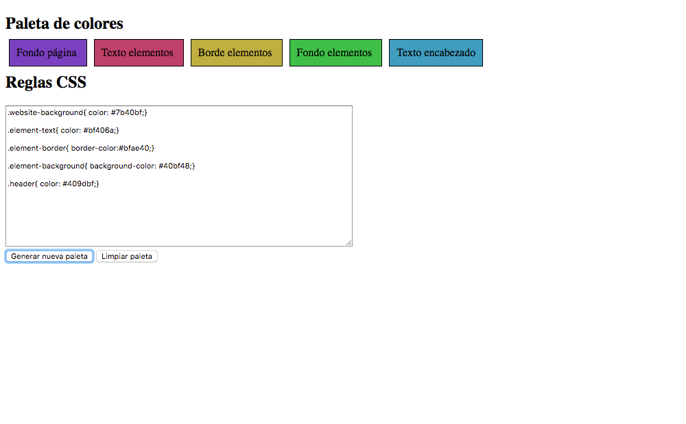
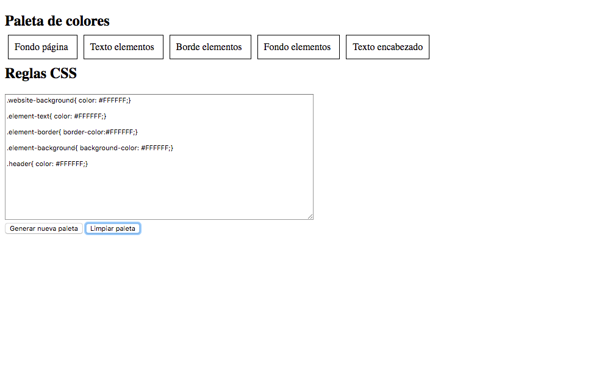

# MISO_REGRESSION_TESTING
General activities of Regression testing

1. Create app
2. Take screenshot using [Cypress](https://www.cypress.io/)
3. Compare screenshots images using [ResembleJS](https://huddleeng.github.io/Resemble.js/)
4. Generate a report based on the automation of points 2 and 3

----

## Palette Colors Document

 **0. Exceute:**
  
    $ npm install

 **1. Repository Link:** [Github](https://github.com/makitodev/MISO_REGRESSION_TESTING)

 **2. Application Link:** [REGRESSION_TESTING](https://makitodev.github.io/MISO_REGRESSION_TESTING/)

 **3. ScreenShots using Cypress:**

    - run commannd 
    $ npm run cypress:open
  
when cypress open, select simple_spec.js an run it

CASE 1 ---> Generate Random Color

-------------
CASE 2 ---> Generate random color when it isnt white

-------------
CASE 3 ----> Clean color when palette has selected

 **4. Questions:**

**Do you see any problems with the screenshots taken by Cypress when trying to do Visual Regression Testing?**

I had no problem, i followed the documentation of cypress and before each click of the buttons took screenshot of the website to see the differences in the interface of both states. Cypress create a folder automatically with the images of the screenshots taken from the tests.

